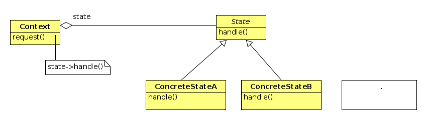

# _State pattern_

U ovom je zadatku potrebno doraditi _Snake_ igru dodavanjem
pozdravnog ekrana, odjavnog ekrana te ekrana za završetak
igre; igra može biti dobivena ili izgubljena.

Igra započinje pozdravnim ekranom. Na primjer:


(Vi ćete staviti svoje ime na ekran.)
Nakon što se pritisne bilo koja tipka počinje igra.
Igrač dobiva ekran igre:


Kada igra završi ispisuje se novi ekran ovisno o tome je li igrač
postigao više od 100 bodova ili nije. Na primjer,
ako je postigao onda ga dočekuje sljedeći ekran:


Ako nije dočekat će ga sličan ekran:


Na oba ova ekrana igrač ima opciju `c` za nastavak igre ili
`x` za izlazak. Nakon što otipka `x` dočekuje ga sljedeći ekran
na kojem se odbrojava od 3 do 0 i zatim se ekran zatvara:


Ako je igrač _pobijedio_ treba povećati brzinu zmije.

## Konačni automat

Vidmo da naša aplikacija ima niz stanja u kojima se ponaša na različite
načine. U igri mora reagirati na strelice, u ostalim stanjima reagira
 na tipke `c` i `x` ili na bilo koju tipku. Svako stanje radi drukčije
 iscrtavanje. Iz jednog stanja se može prijeći u  drugo stanje
 prema _pravilima igre_. Takva se struktura naziva _konačni automat_
 i u našem slučaju može se prikazati na ovaj način:

 


Različita stanja bismo mogli implementirati tako da u tri metode
`Game` klase:  `processEvents()`, `update()` i `render()`  imamo
jednu `if` naredbu unutar koje tretiramo svako pojedino stanje.
Takvo se rješenje ne skalira dobro jer vodi na implementaciju
logike različitih stanja na jednom mjestu.

State oblikovni obrazac na omogućava da kod koji pripada različitim
stanjima odvojimo u zasebne klase


## _State_ oblikovni obrazac

Umjesto da implementiramo logiku različitih stanja u jednoj velikoj if
naredbi stavit ćemo logiku svakog pojedinog stanja u zasebnu klasu. Time dobivamo
sljedeću strukturu:

 

 Ovdje je uvedena apstraktna bazna klasa `State` koja nudi sučelje koje se mijenja
 u svakom pojedinom stanju. Konkretna stanja su implementirana u zasebnim klasama
 `ConcreteStateA`, `ConcreteStateB` itd. Klasa `Context` sadrži kod koji se mijenja
 prilikom promjene stanja. On drži referencu na `State` koja je u svakom trenutku
 inicijalizirana konkretnim stanjem. Dio koda unutar metode `request()` koji ovisi
 o stanju delegira se konkretnom stanju kroz referencu na  `State`. Promjenu stanja
 (prelazak iz jednog stanja u drugo) mogu vršiti sama stanja ili `Context`.

U našem slučaju  `Context` će biti `Game` klasa. Njene funkcije `processEvents()`
`update()` i `render()` ovise o stanju. Ako pogledamo kod u klasi `Game` vidjet
ćemo da ne ovisi čitav `processEvents()` o trenutnom stanju već samo metoda
`handlePlayerInput()`. Stoga u `State` klasu (koju ćemo nazvati `GameState`)
izdvajamo tri metode: `update()`,  `handlePlayerInput()` i `render()`. Te metode
možemo maknuti iz `Game`  klase. Metoda `run()` će ih pozivati kroz pokazivač na
trenutno stanje. Time dolazimo do sljedeće implementacije oblikovnog obrasca:


Ostaje još pitanje tko će mijenjati trenutno stanje u klasi `Game`. U ovom slučaju
to mogu raditi sama stanja. Klasa `Game` treba ponuditi metodu

```c++
void changeState(GameState::State newState)
```
a sve state-klase trebaju uzeti u svom konstruktoru pokazivač na  `Game`
objekt kako bi mogle postaviti sljedeće stanje igre.

Dodatna pitanja:

- Program mora učitati fontove i učiniti ih dostupnim state-klasama koje ih
trebaju.
- Za dobro pozicioniranje teksta state-klase će trebati dimenzije prozora.
- Treba naći način da se postignuti bodovi učine dostupnim state klasama
`WonState` i `LostState`.


## Fontovi i tekst

Kada želimo ispisivati tekst potrebni su nam fontovi. SFML ne
traži fontove na standardnim mjestima na vašem sustavu već ih
morate eksplicitno učitati. Na primjer:

```c++
sf::Font  mFont;
// ...
 if(!mFont.loadFromFile("Comfortaa-Bold.ttf"))
        throw std::runtime_error("Cannot load fonts Comfortaa-Bold.ttf");
```
Fontove možete naći na internetu, na primjer na stranici
[dafont](https://www.dafont.com/). Trebate ih držati zajedno s
aplikacijom što delegiramo CMake sustavu (vidjeti src/CMakeLists.txt).

Tekst je instanca klase `sf::Text`. Tekst koristimo na ovan način:
```c++
sf::Text text;
text.setFont(...);  // Postavi fontove
text.setString("text ...");
text.setCharacterSize(22);
text.setorigin(...,...);   // za bolje pozicioniranje teksta
text.setPosition(...,...); // tekst je sf::Transformable i sf::Drawable
```


Za uptrebu teksta i fontova treba pogledati sfml tutorijal
[Text and fonts](https://www.sfml-dev.org/tutorials/2.5/graphics-text.php)
i dokumentaciju za klase [Text](https://www.sfml-dev.org/documentation/2.5.0/classsf_1_1Text.php)
i [Font](https://www.sfml-dev.org/documentation/2.5.0/classsf_1_1Font.php).
