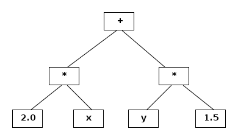

# Expression templates

## Problem


Željeli bismo  imati klasu vektora na kojima su definirane osnovne aritmeričke
operacije, zbrajanje, oduzimanje i množenje skalarom, tako da
u aplikacijskom kodu možemo koristiti __prirodnu sintaksu__ vektorskih operacija .
Na primjer, ako su `x`, `y` i `z` vektori, onda želimo pisati:

```C++
z = 1.2*x + y*2.0
```
s istim efektom kao da smo napisali
```C++
for(size_t i=0; i < dim; ++i) z[i] = 1.2*x[i] + y[i]*2.0;
```
(`dim` je dimenzija vektor).

Implementacija traženih operatora je vrlo jednostavna. Potrebno je
operaore `+`, `-` i `*` definirati kao globalne funkcije. Problem
s tim pristupom je što svaka operacija nužno kreira privremeni
vektor (provjerite) što vodi na gubitak efikasnosti u odnosu na
operacije kodirane u for-petlji po svim elementima. Takav je gubitak
efikasnosti neprihvatljiv u svim numerički intezivnim aplikacijama.

U ovom zadatku koristimo metodu **lijenog izračunavanja** kako bismo
implementirali potrebne operatore
bez gubitka efikasnosti koji dolazi od alokacije privremenih vektora.


### Mjerenje (ne)efikasnosti


Implementiramo aritmetičke operacije za statički alocirani vektor `std::array`  kao globalne funkcije.
Na primjer, za zbrajanje imamo implementaciju:

```C++
template <typename T, size_t dim>
std::array<T,dim> operator-(std::array<T,dim> const& lhs, std::array<T,dim> const& rhs)
{
    std::array<T,dim> tmp;
    for(size_t i=0; i < dim; ++i) tmp[i] = lhs[i] + rhs[i];
    return tmp;
}
```
Taj nam operator omogućava uobičajenu sintaksu na vektorima (`A1`, `A2` i `A3` su tipa `std::array`):

```c++
A3 = A1 + A2;
```

Uspoređujemo vrijeme izvršavanja gornje funkcije s običnom for-petljom.

```c++
for(unsigned int i=0; i < dim; ++i)
        A3[i] = A1[i] + A2[i];
}
```

Rezultati pokazuju da je obična petlja puno brža od upotrebe operatora
 zbrajanja. Razlika ovisi o prevodiocu i stupnju optimizacije. Vidjeti
 program `src/test_speed.cpp`.   

##  Ideja optimizacije aritmetičkih operacija nad vektorima

Aritmetičke operacije koje barataju cijelim vektorima ne smiju niti u jednom trenutku
alocirati privremene vektore. Uz to moraju nuditi prirodnu sintaksu aritmetičkih operacija. Takav se dizajn može postići metodom
lijenog izračunavanja. Osnovna ideja je sljedeća:

- Odgoditi svo računanje do poziva operatoru pridruživanja koji tada
   može direktno
  izračunatu vrijednost smjestiti u vektor na lijevoj strani znaka jednakosti.

To znači da operatori množenja, oduzimanja i zbrajanja trebaju vratiti
   **reprezentaciju operanada i operacije** koju treba izvršiti.
 Sama operacija nije izvršena pozivom operatora već je u tom trenutku konstruiran objekt koji zna kako
   izvršiti operaciju kroz svoj **operator indeksiranja**.
   Taj će operator biti pozvan tek u operatoru pridruživanja.


## Reprezentacija operacija pomoću predložaka klasa


Izraze možemo reprezentirati u obliku binarnog stabla: Na primjer, izraz
```C++
2.0*x+y*1.5
```

ima reprezentaciju




Taj izraz možemo kodirati pomoću predložaka na sljedeći način:

```c++
Add< Mult< Scalar, Vector >, Mult< Vector, Scalar >  >
```

Prvo će nam trebati reprezentacije operanada - skalara i vektora. To će biti klase:
```C++
Scalar, Vector
```
Zatim nam trebaju klase koje reprezentiraju aritmetičke operacije (zbrajanje, oduzimanje, množenje):

```C++
Add<Op1,Op2>    Sub<Op1,Op2>    Mult<Op1,Op2>
```
gdje su Op1 i Op2 operandi.  Činjenica da su operandi parametri predloška klase omogućava lako
komponiranje operacija za vrijeme kompilacije programa.

## Implementacija klasa koje reprezentiraju operacije

- Klase su parametrizirane operandima `OP1` i `OP2`.
- Klasa samo pamti reference na svoje argumente i nudi operator indeksiranja koji implementira operaciju.


```C++
// Klasa koja reprezentira zbrajanje.
template <typename OP1, typename OP2>
class Add{
    private:
    OP1 const & op1;
    OP2 const & op2;
    public:
	Add(OP1 const& a, OP2 const& b) : op1(a), op2(b) {}
	double operator[](int i) const { return op1[i]+op2[i]; }
};
```

**Napomene**:


- Za efikasnost je važno pamtiti reference da izbjegnemo kopiranje objekata.
- Bazični operandi su skalari ili vektori, ali općenito operandi su klase koje reprezentiraju neke operacije
na vektorima i skalarima.
- Drugi važni dio ove konstrukcije je taj što je operacija kodirana u
**operatoru indeksiranja**.


## Klasa koja reprezentira skalare

 Ova klasa je jednostavna. Da bi se skalar ponašao kao i vektor
mora imati operator indeksiranja koji će vratiti vrijednost skalara.


```C++
// Operator indeksiranja vraća vrijednost skalara.
class Scalar{
    private:
	double  const & val;
    public:
	Scalar(double const& v) : val(v) {}
	double operator[](size_t) const { return val; }
};
```

## Klasa Vector


- Klasa `Vector` samo reprezentira vektor (kao što klasa `Scalar` samo reprezentira skalar).
- Za stvarnu implementaciju vektora koristimo klasu `std::array<double, N>`.
-  Klasa `Vector`
implementira sučelje klase `std::array` **forwardirajući pozive implementacijskom objektu**.  


```C++
template <size_t N, typename Rep = std::array<double,N> >
class Vector{
    private:
        Rep expr_rep;  // Implementacijski objekt
    public:
	// Konstruktor inicijalizira implementacijski objekt
         Vector(Rep const& r) : expr_rep(r) {}
	//... svi pozivi idu expr_rep
};
```

Implemetacijski objekt ima dodijeljeni  tip  `std::array<double,N>`
dok je općenito neka `Add`, `Mult` ili `Sub` klasa koja drži reference na stvarne vektore.


## Operator pridruživanja


Ključni element je operator pridruživanja koji zove operator indeksiranja na implementacijskom objektu,
a koji onda zove operatore indeksiranja svojih operanada.

```c++
template <size_t N, typename Rep = std::array<double,N> >
class Vector{
    private:
        Rep expr_rep;  // Implementacijski objekt
    public:
	// Konstruktor inicijalizira implementacijski objekt
	Vector(Rep const& r) : expr_rep(r) {}
	// Vektor možemo inicijalizirati konstantom.
	explicit Vector(double val = 0.0) {expr_rep.fill(val);}
  // pridruživanje polja različitog tipa
   template <typename Rep2>
   Vector& operator=(Vector<N,Rep2> const& rhs){
            for(size_t i=0; i < N; ++i) expr_rep[i]= rhs[i];
            return *this;
   }
   // Pomoćne funkcije
   size_t size() const { return N; }
   double operator[](size_t i) const {  return expr_rep[i]; }
   double& operator[](size_t i) { return expr_rep[i]; }
   Rep const& rep() const { return expr_rep; }
   Rep& rep() { return expr_rep; }
};
```

## Operatori zbrajanja, oduzimanja i množenja


- Operator uzima dva vektora s općenito različitim implementacijskim tipom: `Vector<N,R1>` i `Vector<N,R2>`.
- Sve što operator radi je da konstruira novi vektor s implementacijskim tipom `Add<R1,R2>` (kodiranje operacije).
- Konstruktor novog vektora inicijalizira svoj implementacijski objekt s implementacijskim objektima pribrojnika: `a.rep()` i `b.rep()`.


```C++
// Zbrajanje vektora
template <size_t N,   typename R1, typename R2>
Vector<N, Add<R1,R2> >
operator+(Vector<N,R1> const& a, Vector<N,R2> const& b){
    return Vector<N, Add<R1,R2> >( Add<R1,R2>( a.rep(),b.rep() ) );
}
```


Ako  `x` i `y` vektori tipa  `Vector<N,T>`  gdje je `T=Array<double,N>`, onda
```C++
 2*x+ y
```
konstruira objekt tipa `Vector<N, Impl>` gdje je `Impl =  Add<Mult<2,Array>,Array>`.


Operator indeksiranja se __odmotava__ na sljedeći način. Neka je

```C++
Impl exp_rep;
```
Tada je
```C++
exp_rep[i] --> Mult<2,Array>[i] + Array[i] --> 2*Array[i] + Array[i].
```

Sada treba implementirati i ostale  operatore: oduzimanja vektora, množenja skalara i vektora, množenja vektor i skalara.
Na primjer, kod množenja skalara i vektora skalar predajte konstruktoru na ovaj način:

```C++
// Množenje skalar * vektor
template <size_t N, typename R2>
Vector<N, Mult<Scalar,R2> >
operator*(double const& a, Vector<N,R2> const& b)
{
    return Vector<N,Mult<Scalar,R2> >( Mult<Scalar,R2>( Scalar(a), b.rep() ) );
}
```


## Neke operacije ne rade ispravno! Zašto?

Uočimo da klase koje reprezentiraju operacije drže reference na na druge **operacije/vektore/skalare**:

```C++
// Klasa koja reprezentira zbrajanje.
template <typename OP1, typename OP2>
class Add{
    private:
    OP1 const & op1;
    OP2 const & op2;
    public:
	Add(OP1 const& a, OP2 const& b) : op1(a), op2(b) {}
	double operator[](int i) const { return op1[i]+op2[i]; }
}
```


Ti su objekti inicijalizirani **privremenim objektima**:

```C++
// Zbrajanje vektora
template <size_t N,   typename R1, typename R2>
Vector<N, Add<R1,R2> >
operator+(Vector<N,R1> const& a, Vector<N,R2> const& b){
    return Vector<N, Add<R1,R2> >( Add<R1,R2>( a.rep(),b.rep() ) );
}
```

- *Životni vijek* tih objekta mora biti stoga sve do kraja izračunavanja!
- Vrijednost `a.rep()` ima vijek trajanja vektora `a`, a svi  vektori
traju do kraja izračunavanja jer moraju biti  konstruirani prije nego
što uđu u aritmetički izraz.
- Skalari, s druge strane, često ulaze u izraze kao konstante, a ne
 kao varijable koje žive izvan izraza koji se izračunava. Stoga
 `a.rep()`, ako je `a` skalar ne garantira da će referencu na objekt
  koji živi za cijelo vrijeme trajanja izraza. Stoga u klasu Scalar
  nismo niti stavili metodu `rep()`.


**Primjer**

```C++
// Množenje skalar * vektor
template <size_t N, typename R2>
Vector<N, Mult<Scalar,R2> >
operator*(double const& a, Vector<N,R2> const& b)
{
    return Vector<N,Mult<Scalar,R2> >( Mult<Scalar,R2>( Scalar(a), b.rep() ) );
}
```

- Skalar nestaje nakon što se izvrši konstruktor od `Mult` i implementacijski objekt od `Vector<N,Mult<Scalar,R2> >`
drži referencu na nepostojeću varijablu.


**Zaključak**


-   Klase operacija moraju držati referencu na vektore (da izbjegnu njihovo kopiranje) ali
    *skalare moraju lokalno kopirati*.

- Treba razlikovati template parametar koji je `Scalar` od onog koji to nije.


## Rješenje - klase obilježja


```C++
// Klasa obilježja koja nam omogućava vektor tretiramo kroz
// reference, a skalare po vrijednosti.
template <typename T>
struct Traits{
   typedef T const& ExprRef;
};
// Specijalizacija za skalare
// Na skalare ne uzimamo referencu jer im vijek trajanja može biti kraći od
// vijeka trajanja vektora
template <>
struct Traits<Scalar>{
   typedef Scalar  ExprRef;
};
```


Sada deduciramo traženi tip za dani template parametar:

```C++
// Klasa koja reprezentira zbrajanje.
template <typename OP1, typename OP2>
class Add{
    private:
	typename Traits<OP1>::ExprRef op1;
	typename Traits<OP2>::ExprRef op2;
    public:
	Add(OP1 const& a, OP2 const& b) : op1(a), op2(b) {}
	double operator[](int i) const { return op1[i]+op2[i]; }
}
```


## Zadatak

- Implementirati u potpunosti klasu `Vector` i sve pomoćne klase.

- Operacije testirati u main-funkciji u kojoj na jednom primjeru
treba izmjeriti vrijeme (u mikrosekundama) potrebno da se operacija
izvrši pomoću definiranih operatora i pomoću for-petlje.

- Kreirajte klasu matrica:
```C++
template <typename T, size_t N, size_t M>
class Array2D{
  private:
     T m_data[N][M];
  public:
     const T& operator()(size_t i, size_t j) const {return m_data[i][j];}
     T& operator()(size_t i, size_t j) {return m_data[i][j];}

      // Izbrisana kontrola kopiranja

     size_t rows() const { return N; }
     size_t cols() const { return M; }
};
```

Uključite množenje matrice i vektora u sustav. Sljedeće operacije
 moraju biti dopustive i svo računanje  mora se vršiti u
operatoru pridruživanja:

```C++
const size_t max = 3;
Matrix<max,max> A;

// Napravi tridijagonalnu matricu s 2 na dijagonali i -1 na sporednim dijagonalama.
makeTridiagonalMatrix(A,2.0,-1.0);

Vector<max>  x, y(2.0), z(3.0);
x[0]=1.0; x[1]= 1.5; x[2]=1;
z = A*x;
z = A*x +y;
z = A*(x*3.0 + y);
```

Klasa `Matrix` je klasa matrice koju implementira `Array2D<double,N,M>`.
Bit će potrebno napisati novu funkciju množenja (matrice i vektora) i specijalizirati klasu koja
predstavlja množenje jer ona obavlja operaciju množenja.
