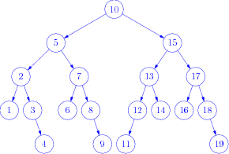
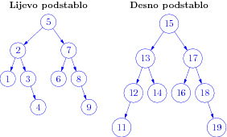
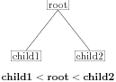
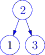
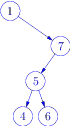
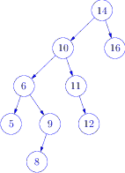
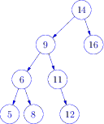

# Binarno stablo pretraživanja  


## Binarno stablo


Binarno stablo je struktura koja se sastoji od podataka istog tipa (čvorovi stabla)
koji su organizirani u hijerarhijsku strukturu. Svaki čvor stabla (roditelj)  povezan je s 
najviše dva čvora stabla (svojom djecom)  koje razlikujemo po položaju (lijevo i desno dijete).
Stablo je stoga ili prazno (nema čvorova) ili ima jedan istaknuti čvor kojeg nazivamo korijen 
stabla (root) te dva podstabla, lijevo i desno, koja su i sama binarna stabla (i stoga mogu biti prazna). 
U sljedećem primjeru 10 je korijen stabla,




a lijevo i desno podstablo dani su na sljedećoj slici: 





Svaki čvor u stablu ima svoju lablelu (_key_). Za labelu pretpostavljamo da ima tip
za koji je dobro definiran relacijski operator `<` (na gornjim slikama labela je tipa _int_).  
*Binarno stablo traženja* je _uređeno_ stablo 
što znači da je labela u korijenu stabla (strogo) veća od svake labele u lijevom podstablu te (strogo) manja
od svake labele u desnom podstablu (kao na prethodnoj slici). To vrijedi i za svako podstablo 
uređenog binarnog stabla.  Binarno stablo traženja stoga ne dozvoljava duplikate. 




## Načini obilaska stabla

Tri su satandardna načina obilaska stabla:

* preorder:  KLD
* inorder:   LKD
* postorder: LDK

Ovdje KLD znači: _korijen - lijevo podstablo - desno odstablo_, te analogno za ostale kratice. 

KLD obilazak znači da prvo posjetimo korijen stabla, zatim lijevo podstablo i na kraju desno podstablo.
Ta je definicija rekurzivna jer posjetiti podstablo znači primijeniti na njega isti algoritam: prvo se posjeti
korijen, zatim lijevo podstablo i konačno desno podstablo.  

### Jednostavan primjer



- preorder:  213
- inorder:   123
- postorder: 132

### Složeniji primjer 



- preorder:  17546
- inorder:   14567
- postorder: 46571

### Rekurzivna implementacija obilaska

Rekurzivna implementacija je vrlo jednostavna. Za obilazak je dovoljno napisati 
funkciju koja uzima pokazivač na korijen stabla te ju pozivati rekurzivno. Na primjer,
ako je element stabla implementiran kao 

```c++
struct Node {
    Node *left;
    Node *right;
    int data;
};
```
onda za ispis u _preorder_ redosljedu možemo pisati:

```c++
void preorder_recursive(Node * sub_root){
  // sub_root je ili nullptr ili korijen stabla ili korijen podstabla
  if(sub_root != nullptr){
     cout << sub_root->data << ",";
     preorder_recursive(sub_root->left);
     preorder_recursive(sub_root->right);
  }
}
```

U našem će primjeru radi općenitosti funkcije obilaska uzimati pokazivač na funkciju 
tipa `void f(int)` i prilikom obilaska ta će funkcija biti primijenjena na svaki posjećeni
element stabla. Na primjer,

```c++
void preorder_recursive(Node * sub_root, void (*f)(int)){
  // sub_root je ili nullptr ili korijen stabla ili korijen podstabla
  if(sub_root != nullptr){
     f(sub_root->data);
     preorder_recursive(sub_root->left, f);
     preorder_recursive(sub_root->right, f);
  }
}
```


### Ubacivanje elementa

Ubacivanje je također vrlo jednostavno ako se izvodi rekurzivno:

- Ako je stablo prazno novi element postaje korijen.
- Ako stablo nije prazno,  novi se element uspoređuje s korijenom i 
** ako je manji od korijena ubacuje se u lijevo podstablo,
** ako je veći od korijena ubacuje se u desno podstablo,
** ako je jednak korijenu vraćamo kod greške jer ne dozvoljavamo duplikate.

Ubacivanje ćemo realizirati pomoću rekurzivne metode 
```c++
ErrorCode insert(Node<T> * & root, T const & t);
```

Ova metoda manipulira s vezama između čvorova i stoga mora dobiti referencu na `root` pokazivač, 
a ne njegovu kopiju. Na primjer, ako je stablo prazno `root` pokazivač je jednak `nullptr`. 
Metoda `insert` dinamički alocira novi čvor i postavlja `root` pokazivač na njega. Za tu operaciju
nam treba referenca na `root`.


### Brisanje elementa

Brisanje elementa je nešto složenije. Kao i kod ubacivanja, mijenjamo stablo i pri tome trebamo
osigurati da su elementi u izmijenjenom stablu u pravilnom poretku. 

- Brisanje elementa lista ne pravi nikakve probleme. Element se može obrisati i odgovarajući pokazivač roditelja 
  se stavlja na `nullptr`.
- Brisanje elementa koji ima samo jedno podstablo (njegov `left` ili `right` pokazivač je jednak `nullptr`) 
  je jednako tako jednostavno. Neka je `sub_root` pokazivač na element koji želimo obrisati (podrazumijeva se da je
  to jedan od dva pokazivača njegovog roditelja).   Ako je `sub_root->left = nullptr` dovoljno je obrisati elemet na koji pokazuje `sub_root` i
  `sub_root` zamijeniti sa `sub_root->right`. 
- Brisanje elementa koji ima oba podstabla je složenije. U tom slučaju ćemo element koji brišemo *zamijeniti* s 
  prvim elementom manjim od njega (ili možemo odabrati prvi element veći od njega). Prvi element manji od danog elementa dobivamo tako
  da krenemo lijevo i zatim desno do kraja.  


Na primjer, u sljedećem stablu želimo obrisati element 10. 




Prvi element manji od 10 je 9 do kojeg dolazimo jednim korakom lijevo i zatim "do kraja" u desno. Taj element nema desno podstablo
jer bi desni element bio veći od njega, a manji od 10. Element 10 ne brišemo iz stabla već na njegovo mjesto stavljamo 9, a element 9 
brišemo. Pri tome ćemo pokazivač na 9 zamijeniti s pokazivačem na njegovo lijevo dijete. Rezultat je:




Privatna metoda `remove` je rekurzivna i ima sljedeću signaturu:
```c++
ErrorCode remove(Node<T> * & root);
```
Uočite da metoda mora uzeti referencu na `root` pokazivač kako bi mogla mijenjati veze između čvorova.


### Nalaženje elementa 
 
Implementirati pomoću pomoćne rekurzivne metode. 

##  Implementacija pomoću pokazivača 


U datoteci _bin_stablo.h_ prvo definiramo klasu `Node` koja predstavlja čvor stabla. 
Svaki čvor sadrži labelu (`data`) i pokazivače na lijevo i desno dijete. Kada čvor 
nema neko dijete odgovarajući pokazivač se stavlja na `nullptr`. 

```c++
template <typename T>
struct Node
{
// konstruktori
    Node();
    Node(T const &);
// podaci
    Node *left;
    Node *right;
    T data;
};
```


Neke metode vraćaju kod uspjeha taj je kod implementiran 
pomoću enumercije `ErrorCode`. 
```c++
enum ErrorCode { success, duplicate, notfound};
```


### Upute

-   Klasa je parametrizirana tipom labele u stablu.
-   Metode za obilazak stabla koje uzimaju funkciju koju primijenjuju na svakom čvoru stabla su parametrizirane.
    To nam omogućava da unjesto funkcije koristimo lambda izraz ili funkcijski objekt. 
-   Defaultni konstruktor kreira prazno stablo pa stoga stavlja `root` na `nullptr`.  
-   Metode za obilazak stabla najlakše se kreiraju kao rekurzivne metode. Kako je signatura javnih funkcija 
    zadana bit će potrebno kreirati pomoćne privatne metode koje će rekurzivno obaviti obilazak.
-   Implementacija funkcije `remove` i clean je za dodatne bodove. Funkcija  `remove` se testira u posebnom 
     testu `test/test_remove`.
-  Kako je klasa `BinarySTree`  predložak klase sve metode se implementiraju u datoteci zaglavlja. 
   U našoj implementaciji kod treba pisati u datoteci `bin_stablo_impl.h` koja se uključuje na kraju datoteke 
   `bin_stablo.h`.

### Glavni program


U glavnom programu pišete svoje testove. 


