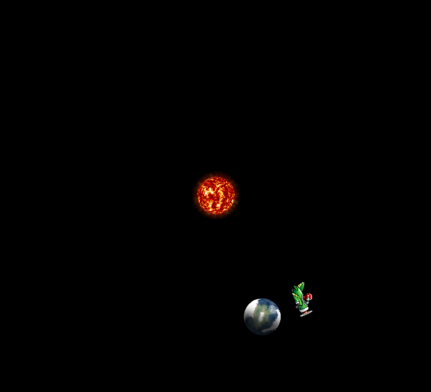

 # Simple and Fast Multimedia Library


Ovdje ćemo ukratko opisati SFML biblioteku (framework) koja je namijenjena uglavnom za razvoj
2D računalnih igara. Biblioteka je podijeljena u 5 modula: *System*, *Window*, *Graphics*,
*Audio* i *Network*.  Web stranica biblioteke je
[www.sfml-dev.org](http://www.sfml-dev.org/).


Za instalaciju na raznim platformama i kompilaciju vidjeti tutorijal na web stranici
[www.sfml-dev.org/tutorials/2.4/](http://www.sfml-dev.org/tutorials/2.4/).


Svi grafički programi implementiraju *program vođen događajima* (*event driven program*).
Cijeli se program sastoji od jedne petlje u kojoj se događaji osluškuju te se na neke od njih reagira.
Same događaje generira operacijski sustav (micanje miša, pritiskanje tipke na tastaturi
i slično) no oni dolaze do programa posredovani grafičkom bibliotekom koja ih prilagođava korištenju
unutar programa.


##  Prvi primjer


Ovdje je dan najjednostavniji primjer SFML programa koji ujedno predstavlja strukturu programa
vođenog događajima:

```cxx
int main()
{
    // Create the main window
    sf::RenderWindow window(sf::VideoMode(800, 600), "SFML window");
    // Load a sprite to display
    sf::Texture texture;
    if (!texture.loadFromFile("cb.bmp"))
        throw std::runtime_error("Cannot open file cb.bmp!");
    sf::Sprite sprite(texture);

	// Start the game loop
    while (window.isOpen())
    {
        // Process events
        sf::Event event;
        while (window.pollEvent(event))
        {
            // Close window : exit
            if (event.type == sf::Event::Closed)
                window.close();
        }
        // Clear screen
        window.clear();
        // Draw the sprite
        window.draw(sprite);
        // Update the window
         window.display();
    }

    return 0;
}
```


*Objašnjnje*:

*  Sve SFML klase nalaze se u imeniku `sf`.
* [sf::RenderWindow](http://www.sfml-dev.org/documentation/2.4.2/classsf_1_1RenderWindow.php)
  je klasa koja predstavlja prozor u koji s lakoćom možemo iscrtavati
  grafičke elemente. Program započinje instanciranjem prozora čiji konstruktor uzima
  [sf::VideoMode](http://www.sfml-dev.org/documentation/2.4.2/classsf_1_1VideoMode.php)
  s danom rezolucijom i naslov ekrana.
* [sf::Texture](http://www.sfml-dev.org/documentation/2.4.2/classsf_1_1Texture.php)
  predstavlja sliku i može se učitati iz datoteke sa diska u različitim formatima pomoću funkcije
  `loadFromFile()`.  Kada `Texture` želimo ispisati na ekranu trebamo s njim inicijalizirati
  [sf::Sprite](http://www.sfml-dev.org/documentation/2.4.2/classsf_1_1Sprite.php)
  koji predstavlja sliku unutar pravokutnika. `sf::Sprite` ne kopira sliku već samo
  drži referencu na `sf::Texture`.
* Cijeli program se nalazi unutar jedne `while` petlje (glavne petlje igre) u kojoj se ispituje
  da li je prozor još otvoren. Program završava ako je prozor zatvoren.
* Unutar glavne petlje rade se dvije stvari: procesiranje događaja i iscrtavanje ekrana.
  * Događaje procesiramo unutar jedne `while` petlje jer u redu događaja može stajati
   više njih koji čekaju da obradu. U ovom programu mi reagiramo na zatvaranje prozora i
   u tom slučaju zatvaramo prozor (`window.close();`) što zaustavlja program. Ostali događaji
   se ignoriraju.
  * Iscrtavanje ekrana se sastoji od čišćenja prošlog sadržaja (`window.clear();`),
    iscrtavanja svih elemenata (ovdje samo jedan sprite) i poziva funkciji `display()` koja
    vrši iscrtavanje.
* Događaji su reprezentirani klasom
  [sf::Event](http://www.sfml-dev.org/documentation/2.4.2/classsf_1_1Event.php).
  Događaje prepoznajemo prema njihovom tipu.


## Game klasa


Naš prvi primjer ćemo transformirati u jednu klasu.

```cxx
#ifndef GAME_V1_H_INCLUDED
#define GAME_V1_H_INCLUDED

#include <SFML/Graphics.hpp>

// Klasa koja predstavlja igru. Osim konstruktora ima samo
// jednu javnu metodu - run().
class Game{
public:
    Game();
    void run();
private:
    // Procesiraj događaje
    void processEvents();
    // konstruiraj novo stanje igre
    void update();
    // iscrtaj novo stanje
    void render();
private:
    sf::RenderWindow mWindow;
    sf::Texture      mTexture;
    sf::Sprite       mSprite;
};

#endif // GAME-V1_H_INCLUDED
```


```cxx
#include "game-v1.h"

int main()
{
    Game game;
    game.run();

    return 0;
}
```


Implementacija metoda klase je posve izravna s time da smo dodali metodu `update() `koja
bi trebala mijenjati sadržaj prozora koji se iscrtava, no za sada je prazna.


```cxx
#include "game.h"

Game::Game() : mWindow(sf::VideoMode(800,600), "Game-v1"){
   if (!mTexture.loadFromFile("cb.bmp"))
        throw std::runtime_error("Cannot open file cb.bmp!");

   mSprite.setTexture(mTexture);
}

// game-loop je sada u metodi run()
void Game::run(){
   while(mWindow.isOpen())
   {
     processEvents();
     update();
     render();
   }
}

// obrada događaja
void Game::processEvents(){
      sf::Event event;
      while(mWindow.pollEvent(event)){
        if(event.type == sf::Event::Closed)
            mWindow.close();
      }
}

// Za sada se stanje ne mijenja. Uvijek iscrtavamo isto.
void Game::update(){
}

// iscrtavanje
void Game::render(){
    mWindow.clear();
    mWindow.draw(mSprite);
    mWindow.display();
}
```

Kod je sada malo obimniji, ali je s druge strane  jednostavniji.


##  Pomicanje sprite-a pomoću tipkovnice


U sljedećem koraku želimo pomicati sliku na ekranu pomoću tipkovnice. U
tu svrhu trebamo obraditi događaje koji dolaze od tipkovnice. To znači da moramo mijenjati
metodu `Game::processEvents()`.


Klasa [Event](http://www.sfml-dev.org/documentation/2.4.2/classsf_1_1Event.php)
popisuje sve tipove događaja u jednoj enumeraciji. Događaju vezani uz tastaturu su
`Event::KeyPressed` i `Event::KeyReleased`.  Objekt klase `Event` ima atribut
`type` na osnovu kojeg dobivamo tip događaja. Ako je događaj jedan od dva događaja s tipkovnicom
onda možemo očitati kod pritisnute/otpuštene tipke pomoću atributa `key`.
Taj atribut ima pak atribut `code`
koji identificira tipku.  Sam code je enumeracija tipa `sf::Keyboard::Key`.  Za sve detalje
vidi dokumentaciju klase
[Event](http://www.sfml-dev.org/documentation/2.4.2/classsf_1_1Event.php).


Ideja pomicanja objekta pomoću tipkovnice je sljedeća: odabrat ćemo tipke za gore-dolje, lijevo-desno.
Od trenutka kada je tipka pritisnuta, do trenutka kada je otpuštena pomičemo objekt za dani iznos. To
ćemo postići pomoću varijabli
`mIsMovingUp`, `mIsMovingDown`, `mIsMovingLeft`, `mIsMovingRight` tipa `bool`
koje signaliziraju treba li vršiti pomicanje
u danom smjeru ili ne. Uvest ćemo jednu pomoćnu metodu
`handlePlayerInput(sf::Keyboard::Key code, bool isPressed)`
koja postavlja logičke varijable na `true` ako je tipka pritisnuta (`isPressed=true`) ili na `false` ako
je tipka otpuštena  (`isPressed=false`). Time u  `Game::processEvents()` metodi samo
zapisujemo što treba učiniti. Samo pomicanje se dešava u `update()` metodi.


Naša klasa time dobiva četiri nove varijable i jednu pomoćnu metodu:

```cxx
#ifndef GAME_H_INCLUDED
#define GAME_H_INCLUDED

#include <SFML/Graphics.hpp>

// Klasa koja predstavlja igru. Osim konstruktora ima samo
// jednu javnu metodu - run().
class Game{
public:
    Game();
    void run();
private:
    // Procesiraj događaje
    void processEvents();
    // konstruiraj novo stanje igre
    void update();
    // iscrtaj novo stanje
    void render();
private:
    sf::RenderWindow mWindow;
    sf::Texture      mTexture;
    sf::Sprite       mSprite;
    bool mIsMovingUp, mIsMovingDown, mIsMovingLeft, mIsMovingRight;
    void handlePlayerInput(sf::Keyboard::Key code, bool isPressed);
};
#endif // GAME_H_INCLUDED
```


Nova implementacija metode  `Game::processEvents()` je dana ovdje.
Kada identificiramo `KeyPressed` ili `KeyReleased` događaj funkciji `handlePlayerInput()`
možemo prenijeti kod pritisnute tipke (`event.key.code`). Druga varijabla funkcije
`handlePlayerInput()` služi za razlikovanje pritisnuti-otpustiti tipku.


```cxx
// obrada događaja
void Game::processEvents(){
      sf::Event event;
      while(mWindow.pollEvent(event)){
        switch(event.type){
        case sf::Event::Closed:
            mWindow.close();
            break;
        case sf::Event::KeyPressed:
            handlePlayerInput(event.key.code, true);
            break;
        case sf::Event::KeyReleased:
            handlePlayerInput(event.key.code, false);
            break;
        }

      }
}
```

Metoda `Game::handlePlayerInput()` ima ovu implementaciju. Ona ne vrši nikakvo pomicanje već samo
prenosi informaciju na varijable članice klase.


```cxx
void Game::handlePlayerInput(sf::Keyboard::Key code, bool isPressed){
    if( code == sf::Keyboard::Up)    mIsMovingUp    = isPressed;
    if( code == sf::Keyboard::Down)  mIsMovingDown  = isPressed;
    if( code == sf::Keyboard::Left)  mIsMovingLeft  = isPressed;
    if( code == sf::Keyboard::Right) mIsMovingRight = isPressed;
}
```

Metoda `Game::update()`  vrši sam pomak objekta. Za to koristimo
[sf::Vector2f](http://www.sfml-dev.org/documentation/2.4.2/classsf_1_1Vector2.php)
koji predstavlja 2D vektor s `float` koordinatama `x` i `y`.
Pomak vršimo za jedan pixel u selektiranim smjerovima. To znači da će pri svakom iscrtavanju
ekrana dok je tipka pritisnuta figura biti pomaknuta za jedan pixel.


```cxx
// Pomicanje figure
void Game::update(){
    sf::Vector2f movement(0.f, 0.f);  // pomak
    if(mIsMovingUp)
        movement.y -= 1.f;
    if(mIsMovingDown)
        movement.y += 1.f;
    if(mIsMovingLeft)
        movement.x -= 1.f;
    if(mIsMovingRight)
        movement.x += 1.f;

    mSprite.move(movement);
}
```

Samo pomicanje obavlja `move` funkcija klase `Sprite`. Funkcije `render` i `draw` ostaju iste
i time smo dobili drugi verziju našeg programa.


### Brzina pomicanja objekta


U prethodnom primjeru smo pomicali sliku za jedan pixel u danom smjeru pri svakom iscrtavanju
ekrana. To nije ono što obično želimo jer ne kontroliramo brzinu pomicanja -- ona ovisi o brzini računala.
Najčešća situacija je da želimo pomicati objekt zadanom (trenutnom)
brzinom te stoga moramo mjeriti vrijeme između dva iscrtavanja i množiti brzinu s proteklim vremenom
kako bismo dobili traženu udaljenost.


Za rad s vremenom nam pomažu dvije klase:
[sf::Clock](http://www.sfml-dev.org/documentation/2.4.2/classsf_1_1Clock.php) i
[sf::Time](http://www.sfml-dev.org/documentation/2.4.2/classsf_1_1Time.php).
Da bismo radili s vremenom
trebamo promijeniti dvije rutine. Prvo mijenjamo rutina `run` koja postaje:

```cxx
// game-loop je sada u metodi run()
void Game::run(){
    sf::Clock clock; // defaultni konstruktor starta sat
    while(mWindow.isOpen())
    {
        // stavi clock na nulu i vrati protekli interval
       sf::Time dt = clock.restart();
       processEvents();
       update(dt);
       render();
    }
}
```

Ovdje smo praktički rutini `update` predali vremenski interval protekao između dva iscrtavanja.
Rutina `update` se mijenja na sljedeći način:

```cxx
// Pomicanje figure
void Game::update(sf::Time const & dt){
    sf::Vector2f movement(0.f, 0.f);  // brzina
    if(mIsMovingUp)
        movement.y -= mSpeed;
    if(mIsMovingDown)
        movement.y += mSpeed;
    if(mIsMovingLeft)
        movement.x -= mSpeed;
    if(mIsMovingRight)
        movement.x += mSpeed;

    mSprite.move(movement * dt.asSeconds());
}
```

Brzina `mSpeed` je skalar koji treba postaviti, na primjer u konstruktoru.


### Fiksiranje vremenskog koraka


Koliki će biti `dt` u prethodnom programu ovisi o brzini iscrtavanja ekrana. Ukoliko
tokom odvijanja programa imamo bitno različit broj objekata koje iscrtavamo odgovarajući `dt`
može bitno varirati. Te su varijacije nepoželjne kada je u pitanju  izračunavanje novog stanja
sustava iz više razloga. Suviše veliki vremenski koraci mogu dovesti do nestabilnosti ukoliko riješavamo
problem gibanja eksplicitnom numeričkom metodom; kod kolizija predmeti mogu _ulaziti_ jedan u drugi.
Varijabilan vremenski korak vodi i na različito akumuliranje grešaka zaokruživanja
što dovodi do nedeterminističnog
ponašanja simulacije -- igrači na računalima različite brzine
(koji eventualno igraju istu igru preko mreže)
ne vide sasvim iste rezultate simulacije.  
Stoga je nužno da `update()` dobiva (približno)
konstantan `dt`.  Tehnika kojom se to može postići prikazana je niže.  U klasu `Game`
smo uveli novu varijablu `mTimePerFrame` koju inicijaliziramo s 1/60 (60 slika u sekundi).
Ako je `dt` veći od te vrijednosti vršimo procesiranje događaja i aktualizaciju scene
 više puta prije iscrtavanja.
Metoda `update()`
se poziva uvijek s `dt=mTimePerFrame`.


```cxx
// Fiksiramo vremenski korak
void Game::run(){
    sf::Clock clock; // defaultni konstruktor starta sat
    // vrijeme od zadnjeg poziva funkciji update()
    sf::Time timeSinceLastUpdate = sf::Time::Zero;

    while(mWindow.isOpen())
    {
       processEvents();
       // stavi clock na nulu i vrati protekli interval
       timeSinceLastUpdate += clock.restart();
       // updatiraj eventualno više puta ako je iscrtavanje bilo sporo
       while(timeSinceLastUpdate > mTimePerFrame)
       {
          timeSinceLastUpdate -= mTimePerFrame;
          processEvents();
          update(mTimePerFrame);
       }
       render();
    }
}
```

Ukoliko je iscrtavanje suviše brzo može se desiti da se metoda `update()`
 preskoči dok se ne akumulira dovoljno proteklog
vremena.  Ako je iscrtavanje suviše sporo `update()` će se izvršiti više puta prije iscrtavanja. Primijetimo
pri tome da vrijeme  `mTimePerFrame` ne smije biti manje od vremena izvršavanja `update()` rutine
jer će unutarnja petlja stalno povećavati broj iteracija, što će usporavati simulaciju. Loša strana ove tehnike je
što se vremena simulacije i iscrtavanja općenito ne poklapaju. Razlika među njima postoji kada varijabla
`timeSinceLastUpdate` u zadnjem prolazu kroz unutarnju petlju ne padne na nulu. Ponekad se ta razlika
vizualno eliminira ekstrapolacijom scene prije iscrtavanja.


## Iscrtavanje oblika

Do sada smo iscrtavali slike (`sprite`), a sada ćemo vidjeti kako iscrtavati geometrijske oblike.
Iscrtavanje se vrši pomoću `draw()` metode `sf::RenderWindow objekta`. Svi se oblici mogu pozicionirati
pomoću `setPosition()` metode, pomicati pomoću `move()` metode, rotirati pomoću `setRotation()` ili
`rotate()` metode te skalirati pomoću `setScale()` i `scale()` metode.

Operacije pozicioniranja, rotacije i skaliranja dešavaju se u odnosu na centar oblika koji je preodređen
kao gornji lijevi vrh oblika. Pomoću metode `setOrigin()` možemo  odrediti novi centar oblika. Kada
želimo promijeniti centra, onda to moramo prvo napraviti kako bi sve ostale transformacije bile relativne
obzirom na novi centar.

Sve se ove metode naslijeđujuiz kalse `sf::Transformable` koji nasljeđuje svaki oblik; vidjeti
[Transformable](https://www.sfml-dev.org/documentation/2.4.2/classsf_1_1Transformable.php).

Oblici koje možemo iscrtavati su:
* [sf::CircleShape](https://www.sfml-dev.org/documentation/2.4.2/classsf_1_1CircleShape.php)
* [sf::RectangleShape](https://www.sfml-dev.org/documentation/2.4.2/classsf_1_1RectangleShape.php)
* [sf::ConvexShape](https://www.sfml-dev.org/documentation/2.4.2/classsf_1_1ConvexShape.php)

Metode koje imaju sve `shape` klase su `setFillColor()`, `setOutlineThickness()`,
`setOutlineColor()`, `setTexture()`  i  `setTextureRect()`.

**Zadatak 1**. Iscrtajte `sprite` unurat kruga radijusa 50, sa rubom debljine 5 u boji (po izboru).
Nemojte koristiti cijeli `sprite` već samo jedan dio (koristeći `setTextureRect()`).

**Zadatak 2**. Imamo tri objekta: Sunce, Zemlju i avion. Sunce stoji u sredini ekrana.
Zemlja rotira oko sunca u negativnom smjeru brzinom od jednog okretaja u minuti i rotira
oko sebe u negativnom smjeru brzinom od jednog okretaja u 5 sekundi. Konačno, avion rotira oko Zemlje,
u istom smjeru kao i Zemlja, brzinom od jednog okretaja u dvije sekunde.


