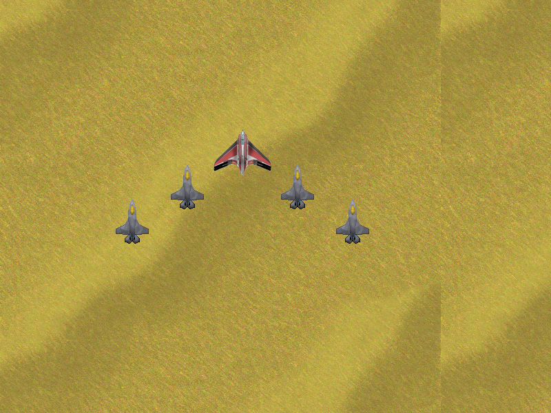
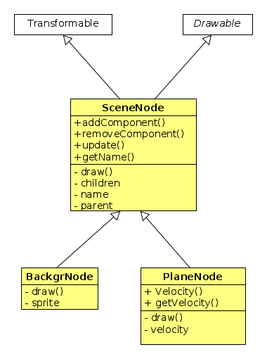

# Konstrukcija grafa scene u SFML-u

Graf scene je primjena _Composite_ oblikovnog obrasca u konstrukciji igre.

## Graf scene

Scena se satoji od pozadine i pet aviona kao na ovoj slici.



U direktoriju `data` dane su tri datoteke za njihovo iscrtavanje: `Eagle.png`
(centralni avion), `Raptor.png` za bočne avione i `Desert.png` za pozadinu.

Inicijalno se iscrta scena koja se sastoji od pozadine i aviona u kojoj svi
elementi miruju. Kada se pritisne lijeva tipka miša avioni se počnu kretati u
smjeru u kojem se pomiče miš (ako miš miruje nema kretanja). Kada se otpusti
tipka kretanje prestaje. Efekt koji treba postići pomoću _Composite_ obrasca je
da se pomicanjem miša pokreću svi avioni čuvajući svoj relativni položaj u
odnosu na glavni avion (`Eagle`).


## _Composite_

U ovoj implementaciji _Composite_ obrasca klasa _SceneNode_ predstavlja
komponentu, dakle klasu koja može predstavljati jednostavni i složeni objekt.
Klasa _BackgrNode_ je jednostavan objekt koji predstavlja pozadinu, a klasa
_PlaneNode_ predstavlja avion. Centralni avion (_Eagle_) je složeni objekt;
lijevi i desni avioni su njegova djeca. Lijevi i desni avion imaju kao svoje
dijete avion lijevo, odnosno desno od sebe. Tek su dva vanjska aviona jednostavni
objekti, odnosno nemaju djecu.



## Iscrtavane i transformacije

Kada želimo da se naša klasa može iscrtavati u prozoru izvodimo je iz klase
`sf::Drawable` koja daje čistu virtualnu metodu `draw()` koju trebamo preraditi
u svakoj klasi koja direktno ili indirektno proširuje `sf::Drawable`. U skladu
s tehnikom programiranja u SFML-u metoda `draw()` se prerađuje u privatnom dijelu
klase. Signaturu funkcije `draw()` može se vidjeti u dokumentaciji klase
[sf::Drawable](https://www.sfml-dev.org/documentation/2.5.0/classsf_1_1Drawable.php).


Kada želimo da se objekti naše klase mogu translatirati, rotirati i skalirati
klasu trebamo konstruirati izvođenjem iz klase `sf::Transformable`. To je implementacijska
bazna klasa koja nuti metode `rotate()`, `move()` i ostale. Detalji se mogu naći u
 dokumentaciji klase [sf::Transformable](https://www.sfml-dev.org/documentation/2.5.0/classsf_1_1Transformable.php).


Tipična implementacija funkcije  `draw()` prikazana je ovdje. Pretpostavimo da imamo
klasu `MyClass` koja prilikom svog iscrtavanja iscrtava samo jedan sprite. Metoda
 `draw()` bi bila implementirana na sljedeći način:

```c++
class MyClass : public sf::Transformable, public sf::Drawable
{
  // ...
private:
  sf::Sprite mSprite;

  virtual void draw(sf::RenderTarget& target, sf::RenderStates states) const
  {
    states.transform *= getTransform();
    target.draw(mSprite, states);
  }
};
```

Metoda `draw()` kroz varijablu tipa [sf::RenderStates](https://www.sfml-dev.org/documentation/2.5.0/classsf_1_1RenderStates.php)
dobiva, između ostaloga, transformaciju  koju treba napraviti na objektu koji
iscrtavamo prije samog iscrtavanja. U većini slučajeva ta je transformacija
identiteta i mi u naredbi `states.transform *= getTransform()` vršimo kompoziciju
te transformacije s transformacijama koje smo izveli na našem objektu pomoću
metoda `move()`, `rotate()` i drugih iz klase `sf::Transformable`. Tu transformaciju
nam daje metoda  `getTransform()` koju naslijeđujemo iz `sf::Transformable`.

Posljedica ovakve konstrukcije je u tome što je transformacija koju radimo na našem objektu
relativna u odnosu na transformaciju koju smo u `sf::RenderStates` varijabli
poslali metodi  `draw()`.

Kod iscrtavanja grafa scene ovakvu konstrukciju metode  `draw()` koristimo kako bi avioni
ostali u istom poretku u svakom trenutku. Glavnom avionu (`Eagle`) postavljamo brzinu, dok ostali
avioni imaju brzinu jednaku nuli. Kod iscrtavanja djece metodi `draw()` šaljemo transformaciju
roditelja i tako osiguravamo jednaku transformaciju cijelog kompozitnog objekta.
Efekt treba biti taj da se svi avioni pomiču na isti način.

Vidjeti još i poglavlje u tutorijalu:


- [Tutorijal - _transforming_](https://www.sfml-dev.org/tutorials/2.5/graphics-transform.php)


## Brisanje aviona

Potrebno je još implementirati metodu `void removeComponent(std::string const & name)`
koja  briše komponentu iz grafa scene. Svakoj komponenti smo dali neko ime. klasa
`SceneNode` ima varijablu `mName` tipa `std::string` i metodu `getName()` koja vraća
ime. Metoda  `void removeComponent(std::string const & name)` treba naći komponentu prema njenom imenu i
obrisati je. Ako komponenta nije nađena ne radi ništa. Brisati ćemo samo `Raptore` i
to pomoću tipki `H`, `J`, `K` i `L`. Svaka tipka briše jedan od aviona. Centralni avion, `Eagle`,
ne brišemo.

**Napomene**.

- Svi elementi grafa scene se alociraju dinamički pomoću operatora `new`
osim eventualno korijenskog čvora. Djeca se pamte u listi koja čuva `std::unique_ptr`
objekte. Na taj način je dealokacija utomatska.
- Svaki čvor u grafu scene može držati pokazivač na svog roditelja. To može olakšati
algoritam brisanja elementa.
- Po svoj prilici bit će Vam potrebna jedna dodatna klasa koja će držati i
inicijalizirati graf scene (`World`?).


## Kako vući objekt pomoću miša?

U našem primjeru kada stisnemo lijevu tipku miša objekt se treba kretati
u smjeru u kojem se kreće miš. Kada tipku otpustimo kretanje prestaje.

SFML će kod pritista tipke miša emitirati događaj (`event`) čiji je tip (`event.type`) jednak
`sf::Event::MouseButtonPressed`.
Tada ispitivanjem varijable `event.mouseButton.button` možete saznati da li je pritisnuta
lijeva tipka (`sf::Mouse::Left`) ili desna (`sf::Mouse::Right`). Varijable
`event.mouseButton.x` i `event.mouseButton.y` daju koordinate točke u kojoj je došlo
do pritiska tipke. Posve analogno kod otpuštanja tipke miša generira se događaj
`sf::Event::MouseButtonReleased`.

Micanjem miša generira se događaj čiji je tip `sf::Event::MouseMoved`. U tom slučaju varijable
`event.mouseMove.x` i `event.mouseMove.y` daju novu poziciju miša.

Pomoću ovih metoda lako je generirati vekotor smjera u kojem se objekt mora
kretati. Samu brzinu kretanja treba odredite sami.  

Vidjeti:
- [Tutorial - events](https://www.sfml-dev.org/tutorials/2.5/window-events.php)

- [API - Event](https://www.sfml-dev.org/documentation/2.5.0/classsf_1_1Event.php)
